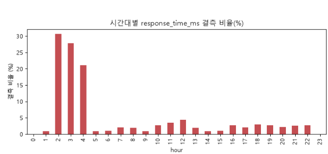
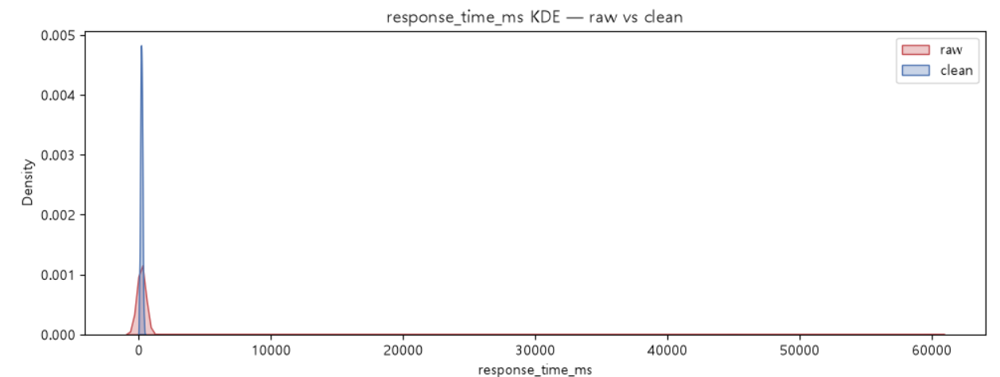
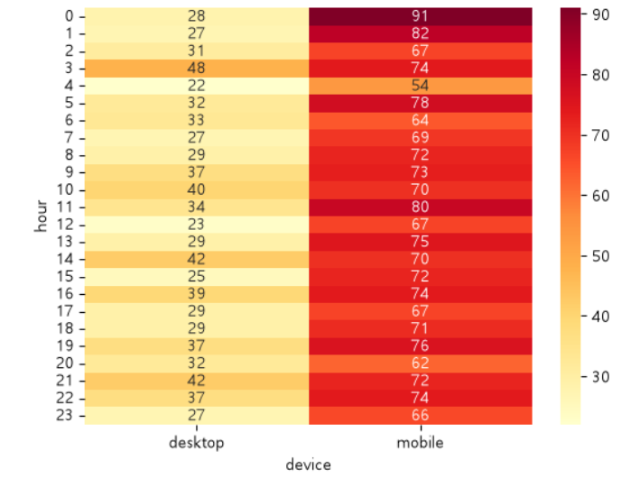
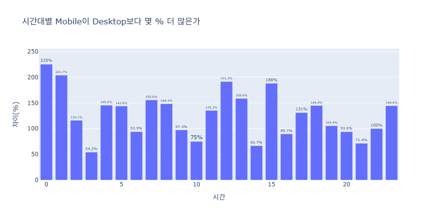

# 모두마켓 웹 접속 로그 — EDA & 시각화 보고서

## 1. 데이터 개요
- 행/열: (2502행, 7열)
- 주요 컬럼: log_id, session_id, response_time_ms, request_path, device, hour, is_error

## 2. 결측 진단 (missingno)
- `response_time_ms` 결측 비율: 4.8 % - > 극단치 NA 처리 후 : 4.88 %
- 결측 패턴: 'hour' 기준 'response_time_ms' 결측 비율을 확인한 결과 2, 3, 4시 경에 결측이 다수 확인됨.

- 의심 가설
1. 2, 3, 4시 새벽 시간 대 사이트 업데이트 혹은 서버 점검으로 인하여 다수 결측될 가능성 높음.
2. session_id 별로 측정값 누락 중복 확인되었으나 최대 2건으로 확인되어 특정 사용자에서 결측이 다수 확인되진 않음.
3. device 별로도 측정값 누락 확인하였으나 desktop, mobile 두 변수간 특이점은 없는 것으로 확인됨.
4. request_path 별로도 측정값 누락 확인하였으나 모든 변수간 특이점은 없는 것으로 확인됨 다만, 발생된 request_path의 점검은 필요할 것으로 사료됨.

## 3. 정제와 검증 (전·후 분포 비교)
- 적용한 정제:
1. 중복 제거 : index 0, 2500 / 1, 2501 총 2건 중복 확인되어 keep = "first"로 중복 처리함.
2. device 표기 통일 : mobile, desktop만 추출되도록 str.lower() 적용함.
3. hour 이상치 : 0 ~ 24 제외 값 NA 처리함.
4. response_time_ms 결측 대체 / 극단치 클리핑 : 0 ~ 3_000 제외 값 NA 처리함.
- KDE 비교 결과:
1. 'response_time_ms'는 이상치 제외로 인하여 긴꼬리가 삭제되어 clean이 좁아진 것으로 확인됨

2. 'hour'는 이상치 제외로 인하였으나 기본적인 분포도는 동일한 것으로 확인됨.

- device distinct: 5 → 2 (정상)

## 4. 탐색에서 도출한 새 질문
- (예) "새벽 시간대 에러 응답 비중이 낮보다 높은가?"
- (예) "`/checkout` 응답 시간이 다른 경로보다 길다 — 결제 단계 최적화 후보인가?"
- device 별 is_error로 체크된 응답이 많은가?
- device 별 response_time_ms의 차이가 있는가?
- request_path 별 is_error로 체크된 응답이 많은가?
- request_path 별 response_time_ms의 차이가 있는가?

## 5. 전달용 차트 1개 (이미지 또는 코드 인용)
- 차트 한 장 + "한 줄 메시지"

'device'에서 mobile이 desktop 보다 더 트래픽이 높은 것으로 확인되었음.
3시 54.2%가 mobile이 desktop 대비 높게 확인되었으며 해당 시간이 최소 차이로 확인되었음.
가장 높은 트래픽이 확인된 시간은 0시이며 desktop 대비 225%로 높은 것으로 확인되었음. 그 외 24시간 중 16개 시간에서 100%이상 트래픽이 높게 확인됨.

## 6. 다음 분석 제안
- 다음 분석 대비 동일 시간에서 결측이 비슷한 분포로 확인되었는지 확인
- hour 이상치가 동일하게 발생하는지 확인(웹 설정 및 DB 점검 필요 여부)
- 중복 데이터 추가 저장되는지 확인 (웹 설정 및 DB DB 점검 필요 여부)