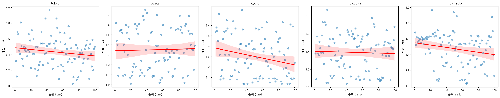
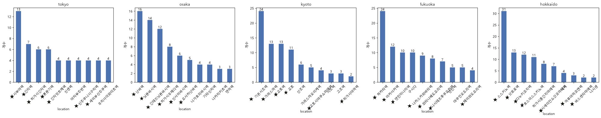
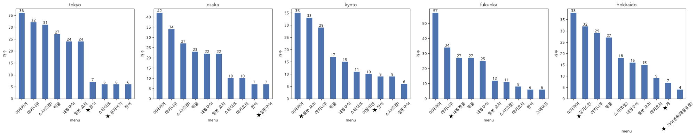
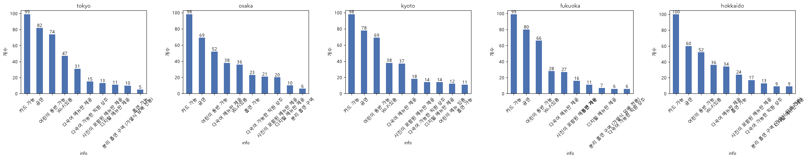
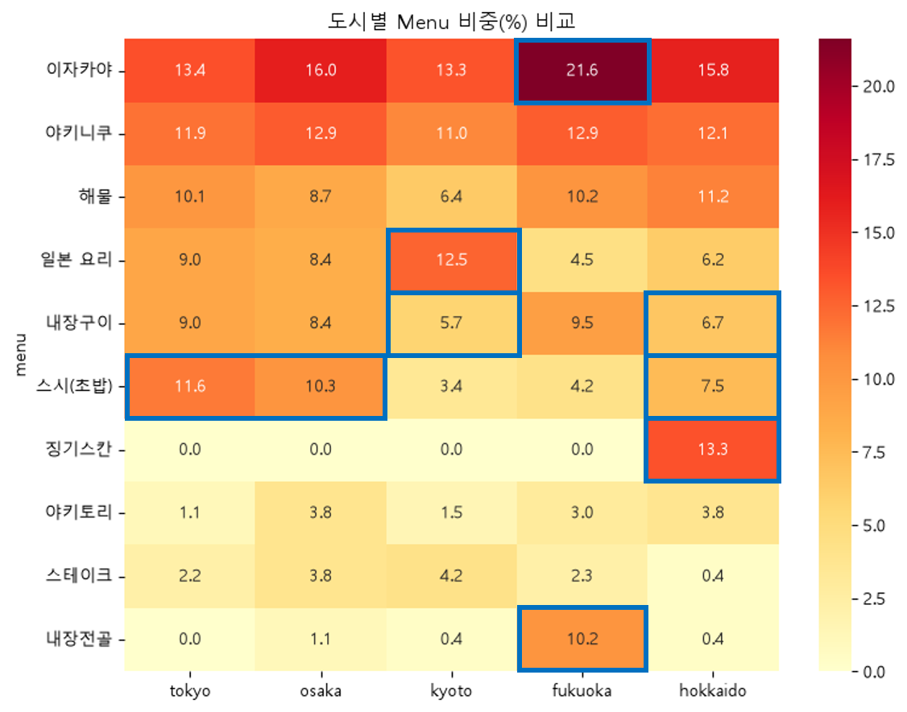
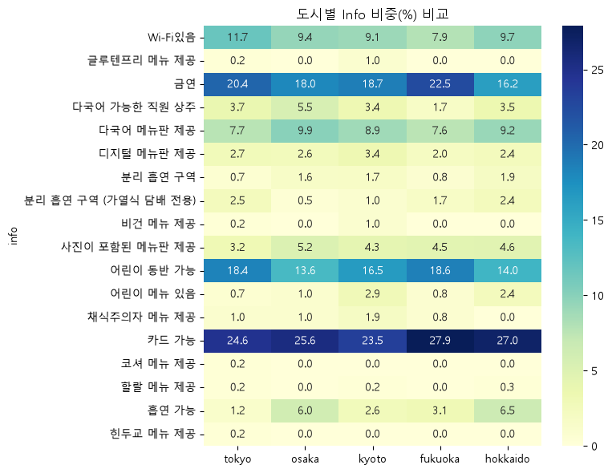

# 웹 스크래핑 Report(표시철)

## 분석 질문하기
1. 평점이 높을 수록 예약 순위가 높을까?
2. 주요 번화가에 맛집이 많이 있을까?
3. top 100안에서 가장 있기 있는 메뉴는 무엇일까?
4. 한국인이 여행을 가장 많이가는 도쿄, 오사카, 후쿠오카, 쿄토, 홋카이도의 패턴이 유사할까?
5. top 100개 식당 중 금연, 어린이 동반 가능, 카드 가능, 다국어 메뉴판, 디지털 메뉴판을 보유하고 있는 식당의 비율은 얼마나 될까?

## 수집대상
- URL : https://tabelog.com/kr/

### robots.txt 정보
- User-agent: *
- Disallow: /ad_mobile/ (모바일 광고)
- Disallow: /rvwr/*/visitdtl/ (개인 리뷰어 상세 페이지)
- Disallow: /yoyaku/tabelog_booking/ (예약 관련 페이지)
- Disallow: /blog/to_blog (블로그 이동 페이지)
- Disallow: /btb/ (특정 경로로 추정)
- Disallow: /*_disallow_bot (bot 제한)
- Disallow: /*_disallow_bot.js

## 데이터 정보
- store_name / str / 업체명
- stat / str / 가장 가까운 역 및 음식 종류
- star / str / 별점
- info / str / 추가 정보

## 데이터 품질 문제
1. stat의 경우 '시부야역 358m / 야키니쿠, 내장구이, 이자카야'와 같이 '가장 가까운 역'과 '음식 종류'가 병합됨.
2. rank(순위)와 star(별점)의 값이 str로 확인됨. 

## 데이터 정제 정보
1. stat의 경우 '시부야역 358m / 야키니쿠, 내장구이, 이자카야'와 같이 '가장 가까운 역'과 '음식 종류'가 병합되어 split(" / ") 처리 후 location, menu 컬럼으로 저장함.
2. location의 경우 가장 가까운 역과 위치 정보가 포함되어 역 정보만 분석하기 위하여 공백 뒤의 거리(m) 정보는 제거함.
3. rank(순위)와 star(별점)의 dtype 각각 int, float으로 변경함.
3. 각 도시별 중복 업소는 0건으로 확인됨.

## 분석 정보(시각화 자료 포함)
1. 평점이 높을 수록 예약 순위가 높을까?

- tokyo: -0.159
- osaka: 0.027
- kyoto: -0.236
- fukuoka: -0.036
- hokkaido: -0.208

2. 주요 번화가에 맛집이 많이 있을까?

3. top 100안에서 가장 있기 있는 메뉴는 무엇일까?

|순위|메뉴|건수|
|---|---|---|
|1위|이자카야|208|
|2위|야키니쿠|158|
|3위|해물|121|
|4위|일본 요리|106|
|5위|내장구이|102|
|6위|스시(초밥)|96|
|7위|스테이크|34|
|8위|야키토리|34|
|9위|내장전골|32|
|10위|징기스칸|32|

4. top 100개 식당 중 금연, 어린이 동반 가능, 카드 가능, 다국어 메뉴판, 디지털 메뉴판을 보유하고 있는 식당의 비율은 얼마나 될까?

|순위|정보|건수|
|---|---|---|
|1위|카드 가능|494|
|2위|금연|369|
|3위|어린이 동반 가능|313|
|4위|Wi-Fi있음|185|
|5위|다국어 메뉴판 제공|167|
|6위|사진이 포함된 메뉴판 제공|84|
|7위|흡연 가능|74|
|8위|다국어 가능한 직원 상주|69|
|9위|디지털 메뉴판 제공|51|
|10위|분리 흡연 구역 (가열식 담배 전용)|31|

5. 한국인이 여행을 가장 많이가는 도쿄, 오사카, 후쿠오카, 쿄토, 홋카이도의 패턴이 유사할까?

## 마무리 정리
1. 관광지(번화가)의 경우 타베로그에 나열된 식당을 선택하는 것이 좋은 방법
2. 일본 여행이 다회차인 경우 관광지 보다는 골목골목 안가본 곳을 여행하기에 타베로그로 검색하는 것은 좋은 선택지가 아닐 수 있음.
3. 타베로그에 기재된 맛집의 경우 카드 사용이 가능하기 때문에 현금 준비 걱정은 No!
4. 일본에서도 어느정도 금연이 필수인 식당이 많아지는 추세이고 어린이 동반도 가능하기에 가족 관광에도 타베로그는 좋은 선택지가 될 수 있음.
5. 각 도시별로 유명한 음식이 있기 때문에 도시에 따라 해당 음식점의 검색도 추천.

## 추후 분석
1. 각 도시별로 60 페이지 총 1200개의 식당 정보가 있어서 추후에는 더 큰 데이터로 비교해보고 싶습니다.
2. 상위 10% 제외한 메뉴들 중 각 도시별로 특이하게 나타나는 메뉴가 있는지 비교해보고 싶습니다.
3. 현재 '예약이 많은 순'으로 분석하였으나 '현지인 예약이 많은 순'과 비교하여 양상이 비슷한지 비교해보고 싶습니다.
4. 각 도시별로 menu를 상세 정보를 취합하여 구체적인 식당 예매 정보를 비교해보고 싶습니다.

