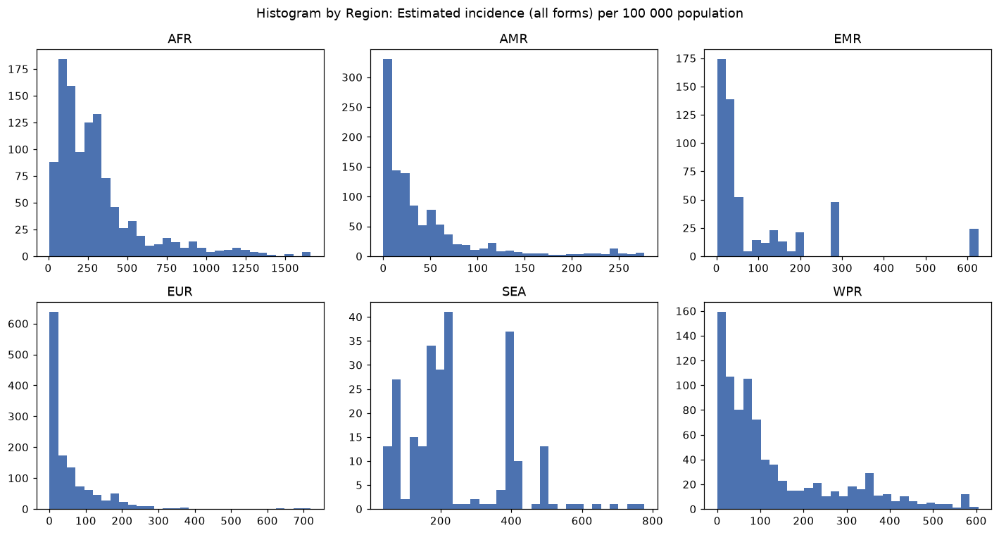
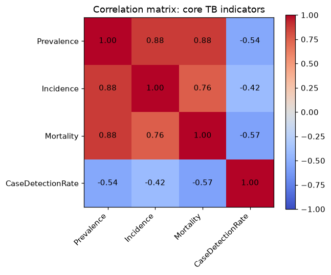
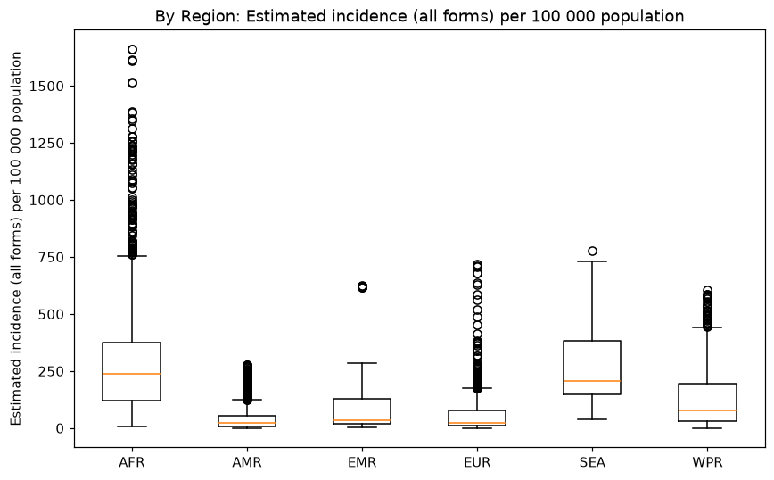
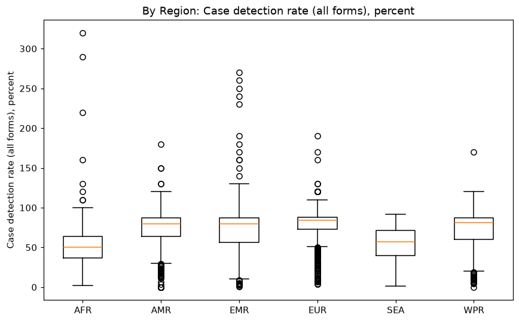
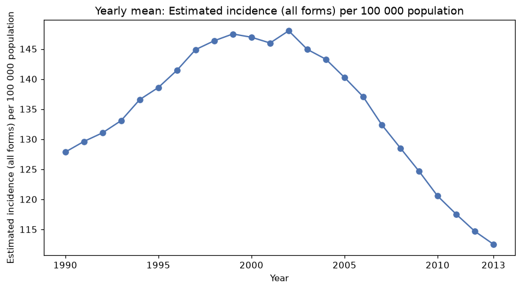
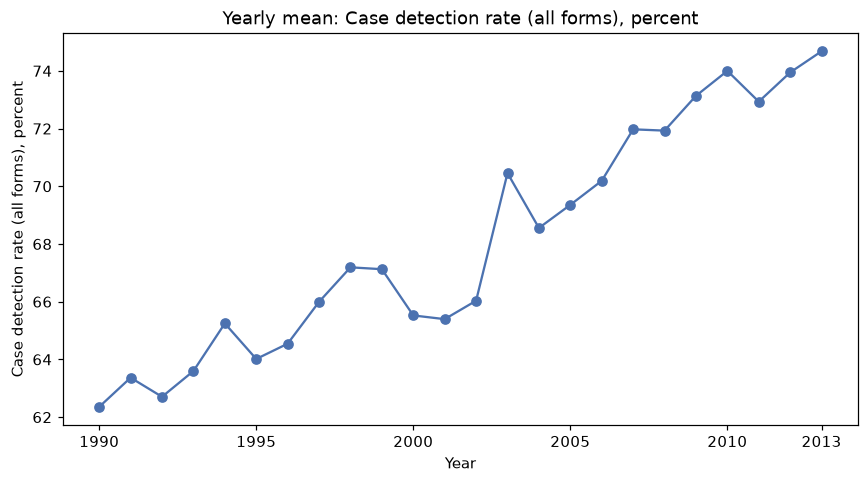
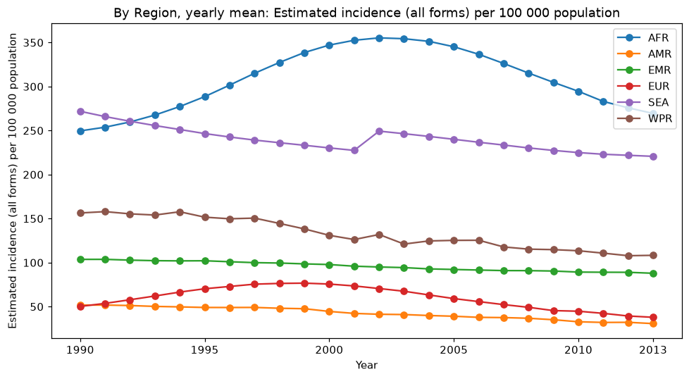

# TB_Burden_Country 탐색적 데이터 분석 보고서

## 1. 데이터 개요
- 행/열: 5120 × 47
- 주요 컬럼: Country or territory name, Region, Year, Estimated total population number, Estimated prevalence of TB (all forms), Estimated incidence (all forms) per 100 000 population, Estimated number of deaths from TB (all forms, excluding HIV), Case detection rate (all forms), percent

- column 별 data type

| 순번 | 컬럼명(원본) | Datatype |
|---|---|---|
| 1 | Country or territory name | str(문자열) |
| 2 | ISO 2-character country/territory code | str(문자열) |
| 3 | ISO 3-character country/territory code | str(문자열) |
| 4 | ISO numeric country/territory code | int64(정수) |
| 5 | Region | str(문자열) |
| 6 | Year | int64(정수) |
| 7 | Estimated total population number | int64(정수) |
| 8 | Estimated prevalence of TB (all forms) per 100 000 population | float64(실수) |
| 9 | Estimated prevalence of TB (all forms) per 100 000 population, low bound | float64(실수) |
| 10 | Estimated prevalence of TB (all forms) per 100 000 population, high bound | float64(실수) |
| 11 | Estimated prevalence of TB (all forms) | float64(실수) |
| 12 | Estimated prevalence of TB (all forms), low bound | float64(실수) |
| 13 | Estimated prevalence of TB (all forms), high bound | float64(실수) |
| 14 | Method to derive prevalence estimates | str(문자열) |
| 15 | Estimated mortality of TB cases (all forms, excluding HIV) per 100 000 population | float64(실수) |
| 16 | Estimated mortality of TB cases (all forms, excluding HIV), per 100 000 population, low bound | float64(실수) |
| 17 | Estimated mortality of TB cases (all forms, excluding HIV), per 100 000 population, high bound | float64(실수) |
| 18 | Estimated number of deaths from TB (all forms, excluding HIV) | float64(실수) |
| 19 | Estimated number of deaths from TB (all forms, excluding HIV), low bound | float64(실수) |
| 20 | Estimated number of deaths from TB (all forms, excluding HIV), high bound | float64(실수) |
| 21 | Estimated mortality of TB cases who are HIV-positive, per 100 000 population | float64(실수) |
| 22 | Estimated mortality of TB cases who are HIV-positive, per 100 000 population, low bound | float64(실수) |
| 23 | Estimated mortality of TB cases who are HIV-positive, per 100 000 population, high bound | float64(실수) |
| 24 | Estimated number of deaths from TB in people who are HIV-positive | float64(실수) |
| 25 | Estimated number of deaths from TB in people who are HIV-positive, low bound | float64(실수) |
| 26 | Estimated number of deaths from TB in people who are HIV-positive, high bound | float64(실수) |
| 27 | Method to derive mortality estimates | str(문자열) |
| 28 | Estimated incidence (all forms) per 100 000 population | float64(실수) |
| 29 | Estimated incidence (all forms) per 100 000 population, low bound | float64(실수) |
| 30 | Estimated incidence (all forms) per 100 000 population, high bound | float64(실수) |
| 31 | Estimated number of incident cases (all forms) | float64(실수) |
| 32 | Estimated number of incident cases (all forms), low bound | float64(실수) |
| 33 | Estimated number of incident cases (all forms), high bound | float64(실수) |
| 34 | Method to derive incidence estimates | str(문자열) |
| 35 | Estimated HIV in incident TB (percent) | float64(실수) |
| 36 | Estimated HIV in incident TB (percent), low bound | float64(실수) |
| 37 | Estimated HIV in incident TB (percent), high bound | float64(실수) |
| 38 | Estimated incidence of TB cases who are HIV-positive per 100 000 population | float64(실수) |
| 39 | Estimated incidence of TB cases who are HIV-positive per 100 000 population, low bound | float64(실수) |
| 40 | Estimated incidence of TB cases who are HIV-positive per 100 000 population, high bound | float64(실수) |
| 41 | Estimated incidence of TB cases who are HIV-positive | float64(실수) |
| 42 | Estimated incidence of TB cases who are HIV-positive, low bound | float64(실수) |
| 43 | Estimated incidence of TB cases who are HIV-positive, high bound | float64(실수) |
| 44 | Method to derive TBHIV estimates | float64(실수) |
| 45 | Case detection rate (all forms), percent | float64(실수) |
| 46 | Case detection rate (all forms), percent, low bound | float64(실수) |
| 47 | Case detection rate (all forms), percent, high bound | float64(실수) |

## 2. 진단 결과
- 결측:

| 컬럼명 | 결측 개수 | 결측률(%) |
|---|---|---|
| Method to derive TBHIV estimates | 5120 | 100.0 |
| Method to derive incidence estimates | 2133 | 41.66 |
| Estimated mortality of TB cases who are HIV-positive, per 100 000 population, low bound | 1942 | 37.93 |
| Estimated mortality of TB cases who are HIV-positive, per 100 000 population, high bound | 1942 | 37.93 |
| Estimated number of deaths from TB in people who are HIV-positive, low bound | 1942 | 37.93 |
| Estimated number of deaths from TB in people who are HIV-positive, high bound | 1942 | 37.93 |
| Estimated HIV in incident TB (percent), low bound | 1478 | 28.87 |
| Estimated HIV in incident TB (percent), high bound | 1478 | 28.87 |
| Estimated incidence of TB cases who are HIV-positive per 100 000 population, low bound | 1478 | 28.87 |
| Estimated incidence of TB cases who are HIV-positive per 100 000 population, high bound | 1478 | 28.87 |
| Estimated incidence of TB cases who are HIV-positive, low bound | 1478 | 28.87 |
| Estimated incidence of TB cases who are HIV-positive, high bound | 1478 | 28.87 |
| Estimated HIV in incident TB (percent) | 1475 | 28.81 |
| Estimated incidence of TB cases who are HIV-positive per 100 000 population | 1475 | 28.81 |
| Estimated incidence of TB cases who are HIV-positive | 1475 | 28.81 |
| Case detection rate (all forms), percent | 449 | 8.77 |
| Case detection rate (all forms), percent, low bound | 449 | 8.77 |
| Case detection rate (all forms), percent, high bound | 449 | 8.77 |
| Estimated incidence (all forms) per 100 000 population, low bound | 94 | 1.84 |
| Estimated incidence (all forms) per 100 000 population, high bound | 94 | 1.84 |
| Estimated number of incident cases (all forms), low bound | 94 | 1.84 |
| Estimated number of incident cases (all forms), high bound | 94 | 1.84 |
| ISO 2-character country/territory code | 24 | 0.47 |
| Estimated prevalence of TB (all forms) per 100 000 population, low bound | 20 | 0.39 |
| Estimated prevalence of TB (all forms) per 100 000 population, high bound | 20 | 0.39 |
| Estimated prevalence of TB (all forms), low bound | 20 | 0.39 |
| Estimated prevalence of TB (all forms), high bound | 20 | 0.39 |

- 이상치:

| 컬럼명 | 유효건수 | IQR 건수(%) | Z-score 건수(%) | MAD 건수(%) |
|---|---|---|---|---|
| Estimated total population number | 5120 | 660(12.89%) | 48(0.94%) | 829(16.19%) |
| Estimated prevalence of TB (all forms) per 100 000 population | 5120 | 309(6.04%) | 86(1.68%) | 672(13.12%) |
| Estimated prevalence of TB (all forms) per 100 000 population, low bound | 5100 | 343(6.73%) | 93(1.82%) | 769(15.08%) |
| Estimated prevalence of TB (all forms) per 100 000 population, high bound | 5100 | 324(6.35%) | 86(1.69%) | 624(12.24%) |
| Estimated prevalence of TB (all forms) | 5120 | 680(13.28%) | 48(0.94%) | 1299(25.37%) |
| Estimated prevalence of TB (all forms), low bound | 5100 | 656(12.86%) | 48(0.94%) | 1351(26.49%) |
| Estimated prevalence of TB (all forms), high bound | 5100 | 641(12.57%) | 64(1.25%) | 1221(23.94%) |
| Estimated mortality of TB cases (all forms, excluding HIV) per 100 000 population | 5120 | 575(11.23%) | 110(2.15%) | 1092(21.33%) |
| Estimated mortality of TB cases (all forms, excluding HIV), per 100 000 population, low bound | 5120 | 545(10.64%) | 106(2.07%) | 1070(20.9%) |
| Estimated mortality of TB cases (all forms, excluding HIV), per 100 000 population, high bound | 5120 | 570(11.13%) | 112(2.19%) | 1025(20.02%) |
| Estimated number of deaths from TB (all forms, excluding HIV) | 5120 | 763(14.9%) | 79(1.54%) | 1396(27.27%) |
| Estimated number of deaths from TB (all forms, excluding HIV), low bound | 5120 | 772(15.08%) | 90(1.76%) | 1398(27.3%) |
| Estimated number of deaths from TB (all forms, excluding HIV), high bound | 5120 | 790(15.43%) | 83(1.62%) | 1466(28.63%) |
| Estimated mortality of TB cases who are HIV-positive, per 100 000 population | 5120 | 905(17.68%) | 141(2.75%) | 2041(39.86%) |
| Estimated mortality of TB cases who are HIV-positive, per 100 000 population, low bound | 3178 | 559(17.59%) | 101(3.18%) | 818(25.74%) |
| Estimated mortality of TB cases who are HIV-positive, per 100 000 population, high bound | 3178 | 535(16.83%) | 90(2.83%) | 801(25.2%) |
| Estimated number of deaths from TB in people who are HIV-positive | 5120 | 871(17.01%) | 97(1.89%) | 1888(36.88%) |
| Estimated number of deaths from TB in people who are HIV-positive, low bound | 3178 | 534(16.8%) | 76(2.39%) | 911(28.67%) |
| Estimated number of deaths from TB in people who are HIV-positive, high bound | 3178 | 547(17.21%) | 78(2.45%) | 866(27.25%) |
| Estimated incidence (all forms) per 100 000 population | 5120 | 314(6.13%) | 111(2.17%) | 558(10.9%) |
| Estimated incidence (all forms) per 100 000 population, low bound | 5026 | 294(5.85%) | 115(2.29%) | 492(9.79%) |
| Estimated incidence (all forms) per 100 000 population, high bound | 5026 | 348(6.92%) | 105(2.09%) | 587(11.68%) |
| Estimated number of incident cases (all forms) | 5120 | 722(14.1%) | 48(0.94%) | 1196(23.36%) |
| Estimated number of incident cases (all forms), low bound | 5026 | 744(14.8%) | 48(0.96%) | 1107(22.03%) |
| Estimated number of incident cases (all forms), high bound | 5026 | 694(13.81%) | 53(1.05%) | 1120(22.28%) |
| Estimated HIV in incident TB (percent) | 3645 | 385(10.56%) | 123(3.37%) | 646(17.72%) |
| Estimated HIV in incident TB (percent), low bound | 3642 | 388(10.65%) | 111(3.05%) | 689(18.92%) |
| Estimated HIV in incident TB (percent), high bound | 3642 | 373(10.24%) | 104(2.86%) | 643(17.66%) |
| Estimated incidence of TB cases who are HIV-positive per 100 000 population | 3645 | 598(16.41%) | 109(2.99%) | 964(26.45%) |
| Estimated incidence of TB cases who are HIV-positive per 100 000 population, low bound | 3642 | 586(16.09%) | 113(3.1%) | 976(26.8%) |
| Estimated incidence of TB cases who are HIV-positive per 100 000 population, high bound | 3642 | 603(16.56%) | 108(2.97%) | 947(26.0%) |
| Estimated incidence of TB cases who are HIV-positive | 3645 | 633(17.37%) | 61(1.67%) | 1136(31.17%) |
| Estimated incidence of TB cases who are HIV-positive, low bound | 3642 | 639(17.55%) | 52(1.43%) | 1200(32.95%) |
| Estimated incidence of TB cases who are HIV-positive, high bound | 3642 | 640(17.57%) | 61(1.67%) | 1070(29.38%) |
| Case detection rate (all forms), percent | 4671 | 23(0.49%) | 22(0.47%) | 146(3.13%) |
| Case detection rate (all forms), percent, low bound | 4671 | 22(0.47%) | 18(0.39%) | 39(0.83%) |
| Case detection rate (all forms), percent, high bound | 4671 | 70(1.5%) | 31(0.66%) | 26(0.56%) |

MAD 방법: Modified Z-score = 0.6745 × (값 - 중앙값) / MAD 로 계산, |Modified Z-score| > 3.5 이면 이상치로 판정

- 중복:

| 기준 | 중복 행 수 |
|---|---|
| 전체 행 기준 | 0건 |
| 자연키(Country or territory name + Year) 기준 | 0건 |

- 특이사항:
1. Method to derive TBHIV estimates 컬럼은 5120건 전체가 결측(100%)으로, 사실상 값이 존재하지 않는 컬럼임.
2. 여러 지표에서 중심 추정치(point estimate) 컬럼은 결측이 없거나 적은데 비해 그에 대응하는 low bound/high bound(신뢰구간) 컬럼은 결측률이 뚜렷하게 높은 패턴이 반복됨(예: Estimated mortality of TB cases who are HIV-positive, per 100 000 population 계열, Estimated number of deaths from TB in people who are HIV-positive 계열 모두 low/high bound만 37.93% 결측).
3. Estimated incidence of TB cases who are HIV-positive 계열은 점추정치(28.81%)와 신뢰구간(28.87%) 간 결측 개수가 3건씩 미세하게 달라 완전히 동일하지 않음.
4. 이상치 판정 결과 모든 수치형 컬럼에서 MAD 방법이 IQR·Z-score 대비 검출 건수가 현저히 많아(예: Estimated mortality of TB cases who are HIV-positive, per 100 000 population은 MAD 39.86% vs IQR 17.68% vs Z-score 2.75%), 분포가 강한 우측 왜도(right-skew)를 가짐을 시사함.

## 3. 처리 결정과 근거

### (1) Method to derive TBHIV estimates 컬럼(100% 결측) 처리
| 이슈 : Method to derive TBHIV estimates 컬럼은 5120건 전체가 결측(100%)으로, 사실상 값이 존재하지 않는 컬럼임
| 결정 : 컬럼은 원본 그대로 유지하며 삭제하지 않되, 추후 대시보드 구성 시에는 해당 컬럼을 사용하지 않음
| 근거 : 원본 데이터 보존을 위해 결측률이 100%라는 사실 자체도 데이터의 특성으로 간주하여 임의로 삭제하지 않으며, 활용(대시보드) 단계에서만 제외하는 것이 원본 훼손을 최소화하는 방법임
| 한계 : 컬럼을 계속 유지함에 따라 후속 분석·코드에서 해당 컬럼을 항상 결측 처리 대상으로 인지하고 제외해야 하는 부담이 남음

### (2) point estimate 대비 결측률이 높은 low/high bound(신뢰구간) 컬럼 처리
| 이슈 : Estimated mortality of TB cases who are HIV-positive 계열, Estimated number of deaths from TB in people who are HIV-positive 계열 등에서 point estimate 컬럼은 결측이 없거나 적은데 대응하는 low/high bound 컬럼만 결측률이 뚜렷하게 높음(예: 37.93%, 28.87%)
| 결정 : 결측을 그대로 유지하며, 별도의 대체(imputation)나 행 삭제를 하지 않음
| 근거 : 이 결측은 국가의 미보고가 아니라 신뢰구간 산출에 필요한 방법론적 근거가 부족했기 때문에 발생한 것으로 판단되므로, 임의로 값을 채우거나 행을 제거하는 것은 실제로 존재하지 않는 정보를 만들어내는 왜곡이 될 수 있음
| 한계 : 향후 대시보드에서 신뢰구간을 활용하는 지표는 point estimate만 존재하는 행이 있을 수 있음을 감안해야 하며, 신뢰구간 기반 시각화·통계 산출 시 유효 표본 수가 point estimate보다 적어질 수 있음

### (3) MAD 기준 이상치 검출이 많은(강한 우측 왜도) 수치형 컬럼 및 100% 초과 사례발견율 처리
| 이슈 : 전체 수치형 컬럼에서 MAD 방법의 이상치 검출 비율이 IQR·Z-score 대비 현저히 높게 나타나며(예: Estimated mortality of TB cases who are HIV-positive, per 100 000 population은 MAD 39.86% vs IQR 17.68% vs Z-score 2.75%), Case detection rate(사례발견율) 컬럼에서도 100%를 초과하는 값이 존재함
| 결정 : 통계적으로 검출된 이상치는 제거·변환하지 않고 원본값을 그대로 유지함. 사례발견율 100% 초과 건도 동일하게 원본값을 유지함(수정·제거하지 않음)
| 근거 : MAD 검출 비율이 세 방법 중 압도적으로 높은 점은 실제 이상치가 아니라 변수 자체가 강한 우측 왜도를 가진 분포적 특성일 가능성이 크며, 사례발견율 100% 초과 역시 원자료의 추정 방식 특성상 발생 가능한 값이므로 임의로 수정·제거하면 원본 정보가 왜곡될 수 있음
| 한계 : 원본값을 그대로 유지함에 따라 평균 등 이상치에 민감한 통계량을 사용할 때는 결과가 왜곡될 수 있어, 후속 분석에서는 중앙값 등 로버스트 통계량을 함께 참고할 필요가 있음

## 4. 처리 후 검증
위 세 가지 결정 모두 컬럼 삭제, 행 삭제, 값 대체·변환을 수반하지 않는 원본 유지 결정이므로, 처리 후에도 데이터의 행/열 구성과 값은 1단계 진단 시점과 동일함. 행/열: 5120 × 47(변동 없음), Method to derive TBHIV estimates 컬럼 결측 5120건(100%, 변동 없음)이며, 신뢰구간 계열 컬럼들의 결측 개수와 이상치 검출 결과도 1단계 진단 결과와 동일하게 유지됨.

## 5. 기초통계

### 5-1. Population(Estimated total population number) - Region별 기초 통계량

| Region | 평균 | 중앙값 | 표준편차 | Q1 | Q3 |
|---|---|---|---|---|---|
| AFR | 15015449.65 | 8301151.00 | 23061554.01 | 1873652.50 | 16487444.00 |
| AMR | 18812128.52 | 2903194.00 | 50696459.90 | 104974.75 | 10825245.00 |
| EMR | 22606584.64 | 9172955.00 | 33632273.40 | 2851520.25 | 26805554.50 |
| EUR | 16419033.88 | 5575237.00 | 26443360.10 | 3150143.00 | 11060095.00 |
| SEA | 151563796.91 | 26099717.00 | 305956959.38 | 17874231.25 | 128100598.75 |
| WPR | 47487880.75 | 271404.50 | 211829051.83 | 56637.25 | 6528704.75 |

### 5-2. Prevalence(Estimated prevalence of TB (all forms) per 100 000 population) - Region별 기초 통계량

| Region | 평균 | 중앙값 | 표준편차 | Q1 | Q3 |
|---|---|---|---|---|---|
| AFR | 370.67 | 326.00 | 274.95 | 154.00 | 496.50 |
| AMR | 62.35 | 33.00 | 79.48 | 10.00 | 74.00 |
| EMR | 152.63 | 51.00 | 218.01 | 23.00 | 205.75 |
| EUR | 97.77 | 29.00 | 182.46 | 12.00 | 113.00 |
| SEA | 407.63 | 407.00 | 274.57 | 216.00 | 487.50 |
| WPR | 241.36 | 107.00 | 317.06 | 45.00 | 314.00 |

### 5-3. Incidence(Estimated incidence (all forms) per 100 000 population) - Region별 기초 통계량

| Region | 평균 | 중앙값 | 표준편차 | Q1 | Q3 |
|---|---|---|---|---|---|
| AFR | 307.88 | 238.00 | 278.97 | 120.00 | 373.50 |
| AMR | 42.47 | 23.00 | 54.06 | 7.60 | 54.00 |
| EMR | 95.96 | 34.50 | 140.51 | 17.00 | 127.25 |
| EUR | 59.87 | 24.00 | 86.57 | 9.60 | 76.00 |
| SEA | 239.64 | 205.00 | 144.57 | 149.00 | 383.00 |
| WPR | 132.93 | 77.00 | 141.06 | 31.00 | 195.50 |

### 5-4. Deaths(Estimated number of deaths from TB (all forms, excluding HIV)) - Region별 기초 통계량

| Region | 평균 | 중앙값 | 표준편차 | Q1 | Q3 |
|---|---|---|---|---|---|
| AFR | 8388.47 | 2500.00 | 20606.91 | 830.00 | 6050.00 |
| AMR | 626.15 | 42.00 | 1471.73 | 1.20 | 450.00 |
| EMR | 5783.48 | 520.00 | 17933.72 | 33.00 | 3000.00 |
| EUR | 1050.01 | 160.00 | 3681.85 | 25.00 | 550.00 |
| SEA | 62932.12 | 10000.00 | 106284.73 | 1200.00 | 81000.00 |
| WPR | 5692.92 | 21.00 | 21597.10 | 3.60 | 592.50 |

### 5-5. CaseDetectionRate(Case detection rate (all forms), percent) - Region별 기초 통계량

| Region | 평균 | 중앙값 | 표준편차 | Q1 | Q3 |
|---|---|---|---|---|---|
| AFR | 50.80 | 50.00 | 23.72 | 37.00 | 64.00 |
| AMR | 72.47 | 80.00 | 22.73 | 64.00 | 87.00 |
| EMR | 72.85 | 80.00 | 32.03 | 56.00 | 87.00 |
| EUR | 78.68 | 84.00 | 18.66 | 73.00 | 88.00 |
| SEA | 53.50 | 57.00 | 23.01 | 40.00 | 71.00 |
| WPR | 71.77 | 81.00 | 22.32 | 60.00 | 87.00 |

### 5-6. Incidence 분포(Region별 히스토그램)

### 5-7. 핵심 지표 간 상관행렬

Prevalence, Incidence, Mortality, Case detection rate 간 상관행렬

### 5-8. Region별 Incidence 그룹 비교

### 5-9. Region별 Case detection rate 그룹 비교

### 5-10. 연도별 전체 Incidence 추이

### 5-11. 연도별 전체 Case detection rate 추이

### 5-12. Region별 연도별 Incidence 추이

## 6. 후속 권고
- 한계
  - 이상치를 원본 그대로 유지하기로 결정했으므로, 평균 등 이상치에 민감한 통계량을 사용할 때는 중앙값 등 로버스트 통계량과 함께 해석해야 함
  - 신뢰구간(low/high bound) 컬럼은 방법론적 근거 부족으로 인한 결측이 존재하여, 신뢰구간을 활용하는 지표는 point estimate만 존재하는 행이 있을 수 있음
  - Region별 그룹 비교 및 시계열 추이는 국가별 인구 규모를 고려하지 않은 단순(비가중) 평균이므로, 인구 가중 평균과는 다른 결과를 보일 수 있음

- 대시보드 후보 지표
  - Region별·연도별 Incidence, Prevalence, Case detection rate 추이
  - Region별 Case detection rate 순위 및 Region 간 격차

- 후속 질문 후보
  - 국가별 인구 규모를 가중한 지표로 보면 Region별 순위가 달라지는가?
  - Case detection rate가 100%를 초과하는 국가·연도는 어떤 공통 패턴을 보이는가?
  - 신뢰구간 결측이 있는 지표는 대시보드 시각화에서 어떻게 표기할 것인가?